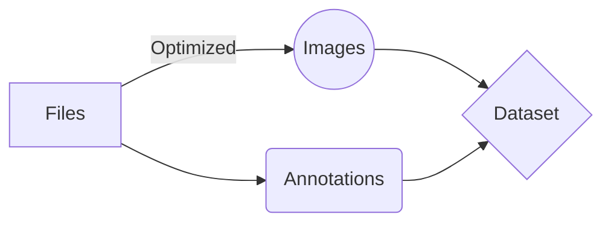

# What is NeuralPrepareDataset

The program is designed for convenient work with the preparation of the user dataset.
All you need to do is to create in the working directory a folder **images/** and place there all the images in **.jpg** format.

The program allows you to make each file an image unique - that will simplify the work in the group for creating annotations (so there were no collisions with the names of files).
The program also optimizes the image and reduces its size to **640x480 pixels**, which is quite enough to train the **Convolutional Neural Network (CNN)**

## How it works

## License
[MIT](https://opensource.org/licenses/MIT)

Copyright (c) 2022, MethaTrader
